1. 프로젝트 개요 (Overview)
   -  Assignment 1-1 : Make os_ftrace system call
   -  Assignment 1-2 : Make Wrapping & hooking modules
   -  Assignment 1-3 : Make trace modules

2. 설계 및 구현 상세 (Design & Implementation)
[User Program]
      |
      |  syscall: os_ftrace(pid)
      v
=================================================
 ftracehooking.c
=================================================
      |
      | 1. sys_call_table[__NR_OS_FTRACE]
      |    → my_ftrace 로 후킹됨
      v
-------------------------------------------------
 my_ftrace(pid)
-------------------------------------------------
      |
      | if (pid > 0)
      |     └─ start_io_trace(pid)
      |
      | else if (pid == traced_pid)
      |     └─ stop_io_trace()
      v

=================================================
 iotracehooking.c
=================================================

 start_io_trace(pid)
      |
      | 2. sys_call_table 접근
      | 3. open/read/write/lseek/close
      |    시스템콜 주소 백업
      |
      | 4. sys_call_table 치환
      |    ├─ __NR_openat → ftrace_openat
      |    ├─ __NR_read   → ftrace_read
      |    ├─ __NR_write  → ftrace_write
      |    ├─ __NR_lseek  → ftrace_lseek
      |    └─ __NR_close  → ftrace_close
      |
      v
-------------------------------------------------
 [Tracing Active]
-------------------------------------------------
      |
      | process executes file I/O
      |
      | open/read/write/close
      v
-------------------------------------------------
 ftrace_openat()
 ftrace_read()
 ftrace_write()
 ftrace_lseek()
 ftrace_close()
-------------------------------------------------
      |
      | → statistics collection
      | → original syscall 호출
      v

=================================================
 stop_io_trace()
=================================================
      |
      | 5. sys_call_table 원복
      | 6. 통계 출력
      | 7. tracing 종료
      v
-------------------------------------------------
 [Tracing End]
-------------------------------------------------


---

2.2.핵심 코드
 
**핵심 데이터 구조:** 과제에서 정의하거나 사용한 주요 구조체(struct) 설명

- Assignment 1-1 
```
// Define System call
SYSCALL_DEFINE1(os_ftrace,pid_t,pid)
{
	printk(KERN_INFO"ORIGINAL ftrace() called! PID is [%d]\n",pid);
	return 0;

}

```

- Assignment 1-2

```
/*
* hook_init
* 
* 1. Locate sys_call_table using kallsyms
* 2. Save original syscall pointer
* 3. Temporarily disable write protection
* 4. Replace syscall entry with fook function
*/
static int  __init hook_init(void)
{
	sys_call_table = (unsigned long**)kallsyms_lookup_name("sys_call_table");

	if(!sys_call_table)
	{
		printk(KERN_ERR "Couldn't find sys_call_table\n");
		return -EINVAL;
	}

	real_os_ftrace = (os_ftrace_t)sys_call_table[__NR_os_ftrace];
	printk(KERN_INFO "saving real_os_ftrace = %px\n", real_os_ftrace);

	make_rw(sys_call_table);
	sys_call_table[__NR_os_ftrace] = (unsigned long*)my_ftrace; 
	make_ro(sys_call_table);

	printk(KERN_INFO "os_ftrace hooked!\n");

	return 0;
}


/*
* hook_exit - module unload routine
* 
* Restore original syscall pointer to prevent
*/
static void __exit hook_exit(void)
{
	if (!sys_call_table || !real_os_ftrace) return;
	
	make_rw(sys_call_table);
	sys_call_table[__NR_os_ftrace] = (unsigned long*)real_os_ftrace;
	make_ro(sys_call_table);

	printk(KERN_INFO "os_ftrace restored\n");
	
}

```


**Assignmnet 1-3**

ftracehooking.h
```
/*
* struct io_trace_stats - I/O tracing statistics
* 
* This structure stores statistics of file I/O operations
* performed by the traced process.
* 
* Counters are increased whenever the hooked functions
* are invoked through ftracehooking.c
*/
struct io_trace_stats{
	int		open_count;		/* number of open calls */
	int		close_count;	/* number of close calls */
	int		read_count;		/* number of read calls */
	int		write_count;	/* number of write calls */
	int		lseek_count;	/* number of lseek calls */

	size_t	read_bytes;		/* total bytes read */
	size_t	write_bytes;	/* total bytes written */

	char	filename[256];	/* last accessed file name */
};

/*stats
* 
* Global I/O statistics shared between modules
* Updated by ftrace hooks during runtime
*/
extern struct io_trace_stats stats; 

```

ftracehooking.c
```
/* ============================================================
 *  Hooked os_ftrace syscall
 * ============================================================ */
asmlinkage long my_ftrace(pid_t pid)
{
    /* stop tracing */
    if (traced_pid && pid ==traced_pid){
        stop_io_trace();
        traced_pid = 0;
	    return 0;
    } 
   
    /* start tracing */
    if (pid > 0) { 
        start_io_trace(pid);
    }

    return 0;
}
```

iotracehooking.c
```
/* ============================================================
 *  Trace control
 * ============================================================ */

void start_io_trace(pid_t pid)
{
    traced_pid = pid;
    syscall_table = (void**) kallsyms_lookup_name("sys_call_table");

    make_rw((unsigned long)syscall_table); 

    real_openat =(void*) syscall_table[__NR_openat];
    real_read = (void*)syscall_table[__NR_read];
    real_write =(void*) syscall_table[__NR_write];
    real_lseek =(void*) syscall_table[__NR_lseek];
    real_close =(void*) syscall_table[__NR_close];

    syscall_table[__NR_openat] = ftrace_openat;
    syscall_table[__NR_read] = ftrace_read;
    syscall_table[__NR_write] = ftrace_write;
    syscall_table[__NR_lseek] = ftrace_lseek;
    syscall_table[__NR_close] = ftrace_close;

    make_ro((unsigned long)syscall_table); 

    printk(KERN_INFO "[iotrace] pid%d tracing start\n",pid);
}
EXPORT_SYMBOL(start_io_trace);

void stop_io_trace(void)
{
    if(!syscall_table) return;
 
    make_rw((unsigned long)syscall_table);

    if (real_openat) syscall_table[__NR_openat] = (void *)real_openat;
    if (real_read)   syscall_table[__NR_read]   = (void *)real_read;
    if (real_write)  syscall_table[__NR_write]  = (void *)real_write;
    if (real_lseek)  syscall_table[__NR_lseek]  = (void *)real_lseek;
    if (real_close)  syscall_table[__NR_close]  = (void *)real_close;

    make_ro((unsigned long)syscall_table);

    printk(KERN_INFO "[2021202089] %s file[%s] stats [x] read - %zd / written - %zd",
                    current->comm,stats.filename,stats.read_bytes,stats.write_bytes);
    printk(KERN_INFO "open[%d] close[%d] read[%d] write[%d] lseek[%d]",
                    stats.open_count,stats.close_count,stats.read_count,stats.write_count,stats.lseek_count);

    printk(KERN_INFO "OS Assignment2 ftrace [%d] End\n",current->pid);
}
EXPORT_SYMBOL(stop_io_trace);

```

---


3. 커널 수정 및 빌드 절차 (Kernel Modification & Build)

**빌드 및 설치:** 커널 소스 트리 내에서 변경하거나 추가한 파일 경로

   3-1. Kernel Compile


3-2. nokalsr 설정
- Grub에서 nokalsr 설정이 되어 있는지 확인합니다. 
- KASLR (Kernel Address Space Layout Randomization)이란 커널이 부팅될 때마다 커널 코드와 데이터가 위치하는 메모리 주소를 무작위로 바꾸는 보안 기술입니다.
- Assignment1에서는 커널 주소를 직접 참조하거나 수정해야 하기 때문에 해당 설정을 꺼야 합니다.

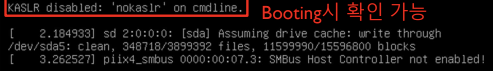

- $ vi etc/default/grub (Grub 설정 파일 수정)
- $sudo update-grub (Grub 설정 파일 수정)


3.3. Kernel Source 다운로드
-  http://www.kernel.org 에서 다운로드를 진행합니다. ( 버전 : 5.4.282)
-  $ sudo wget https://cdn.kernel.org/pub/linux/kernel/v5.x/linux-5.4.282.tar.xz ( root 권한필요 )
- $ tar -xvf linux-5.4.282.tar.xz ( 코드 압축 해제)

3.4 Kernel Extra Version 수정 (선택)
- $ cd linux-5.4.282 
- $ vi Makefile

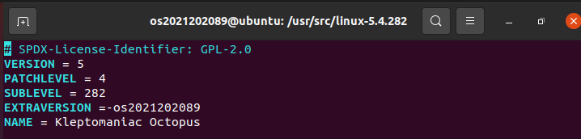

3.4. Kernel 환경 설정
- $ sudo apt install build-essential libncurses5-dev bison flex libssl-dev libelf-dev dwarves zstd
- $ sudo make menuconfig

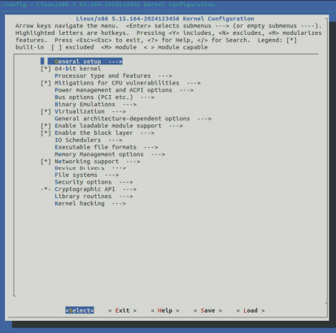

(1) 커널 모듈 적재 시 발생할 수 있는 문제를 해결합니다.
- “Enable loadable module support” è “Forced module loading” 체크
- ESC 두 번 연속 입력 시 이전 메뉴로 복귀

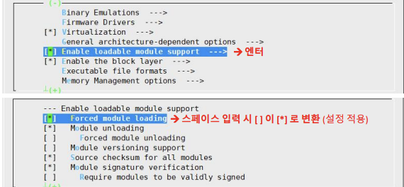
- 

(2) 컴파일 시 문제가 될 수 있는 모듈을 제거합니다.
- “Device Drivers” -> “Staging drivers” 체크 해제

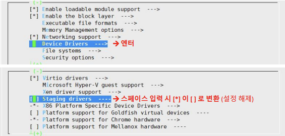

(3) 컴파일 시 문제가 될 수 있는 옵션을 제거합니다.

- “Binary Emulations” -> “x32 ABI for 64-bit mode” 체크 해제


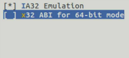

(4) 설정을 파일(.config)에 저장합니다.

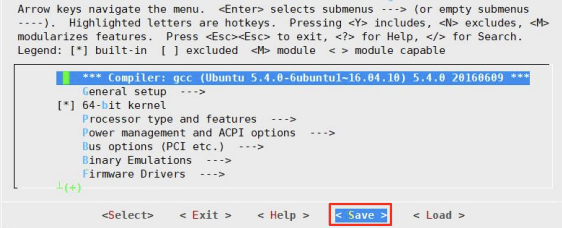

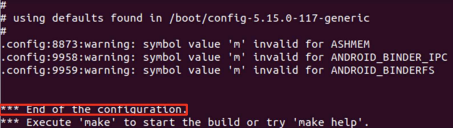

(5) 시스템 폐기키 및 보안키 비활성화
- 스크립트 활용하여 수정
- $scripts/config --disable SYSTEM_TRUSTED_KEYS
- $scripts/config --disable SYSTEM_REVOCATION_KEYS

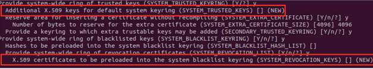

(6) initramfs 설정 변경
- Error : initd is too big 방지를 위한 모듈 설정
- $cd /etc/initramfs-tools
- $vi initramfs.conf

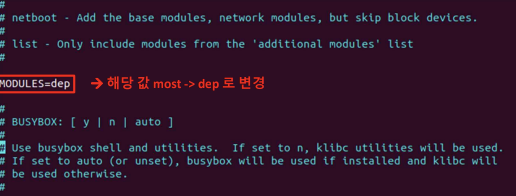

3.5 재부팅
- $ reboot
- Grub 부트로더 선택 메뉴에서 컴파일한 커널 선택

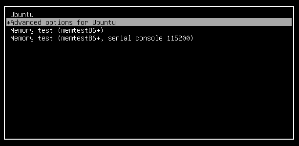
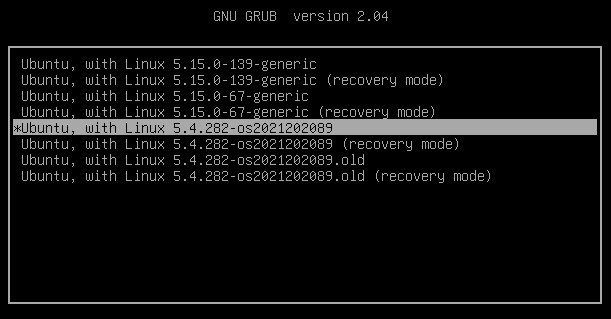

- 커널 버전 확인
- $ uname -r

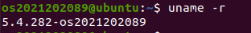

---
<br>

4. 리팩토링 및 최적화 사항 (Refactoring Details)

### 목표
- 코드 가독성 향상 및 커널 안정성 확보
- 중복 로직 제거 및 함수 단위 기능 분리

###  주요 수정 사항
1. **Assignment 1-2: Process Tracer**
   -  중복된 ftrace wrapper 제거
   -  불필요한 __SYSCALL_DEFINEX 사용 제거
   -  하드코딩된 syscall 번호(336) 상수화
   -  syscall index 의존성 명확화
   -  로그 메시지 통일
   -  make_rw / make_ro 안정성 강화
   -  함수 선언 위치 정리
   -  static / const 정확히 사용
   -  커널 코딩 컨벤션 정렬
2. **Assignment 1-3: Process Tracer**
   - 중복 코드 정리
   - 시스템 콜 매직 넘버 제거
   - 함수 포인터 타입 추상화 (typedef)
   - 후킹 로직 흐름 구조 개선
   - 디버그 로그 정리 및 최소화
   - 전역 통계 구조 초기화 위치 개선
   - 코드 스타일 및 주석 형식 통일

---

5. 실행 결과 및 테스트 (Verification)

- **테스트 시나리오:** 구현한 기능을 검증하기 위해 작성한 테스트 케이스 설명

- Assignment 1-1

1) System call table 등록

2) 새로운 System call 작성


3) System Call 함수 작성 (os_ftrace.c)


4) System call 함수에 대한 Makefile 작성


5) 커널 컴파일 


6) 테스트 프로그램 작성

7) 로그 확인

- Assignment 1-2

1) 모듈 소스 프로그램 작성 – os_ftracehooking.c

2) 모듈 소스 프로그램 작성 - Makefile 작성

3) 소스 컴파일

4) 테스트 프로그램 작성

5) 모듈 적재


6) 모듈 동작 확인


7) 모듈 제거 

8) 로그 확인

- Assignment 1-3

1) ftracehooking.h 작성 - 구조체 정의

2) ftracehooking.c 작성


3) iotracehooking.c 작성


4) Makefile 작성


5) 소스 컴파일


6) 모듈 적재


7) 모듈 적재 확인

8) 테스트 프로그램 작성 및 실행

9) 모듈 제거

10) 로그 확인

- **예외 상황 테스트:** 잘못된 입력값이나 환경에서의 에러 핸들러 동작 확인


---

6. 문제 해결 및 고찰 (Troubleshooting & Conclusion)

- **시행착오:** 커널 패닉이나 빌드 오류 발생 시 해결했던 과정

문제 발생 : 
Assignment 1-3 에서 실행 테스트 파일인 test.c 에 대해서 ./test 를 할 경우
CPU disabled by guest 메시지가 뜨면서, VM 이 아예 멈추는 현상이 발생하였다. 이에
대한 원인은 여러가지인데, 그래서 찾아보니까 Kernel Panic 현상임을 알게 되었다.
그래서 왜 발생했는지 dmesg 를 통해 보니까, 커널 기록에서 ./test 실행 중 커널이
죽는 현상임을 알게 되었다. 문제가 발생했던 iotracehooking.c 에서는 open ,write,
read,lseek,close 시스템 콜에 대해서, kallsysms_lookup_name() 을 통해, __x64_sys_openat,__x64_sys_read 을 직접 찾아서 수정하는 코드로 이루어졌었는데, 이로 인해 함수포인터가 유효하지 않은 주소를 가리켜서, 권한레벨 0 에서 CPU 가 잘못된 명령
실행으로 감지하고 Kernel Panic 이 발생한 것이었다. 

해결 : 
openat,write,read,lseek,close 에 대한 시스템 콜 hooking 방식을 수정하니까 , 더 이상
커널 패닉이 발생하지 않고, 모듈이 정상적으로 동작하였다.

- 문제가 발생하였던 코드
```
void start_io_trace(pid_t pid)
{
    traced_pid = pid;
    syscall_table = (void**) kallsyms_lookup_name("sys_call_table");

    make_rw((unsigned long)syscall_table); 
   /* ============================ 문제가 발생한 부분 ========================== */
    real_openat =(void*)kallsyms_lookup_name("__x64_sys_openat);
    real_read = (void*)kallsyms_lookup_name("__x64_sys_read);
    real_write =(void*) kallsyms_lookup_name("__x64_sys_write);
    real_lseek =(void*) kallsyms_lookup_name("__x64_sys_lseek);
    real_close =(void*) kallsyms_lookup_name("__x64_sys_close);
   /* ======================================================================== */
    syscall_table[__NR_openat] = ftrace_openat;
    syscall_table[__NR_read] = ftrace_read;
    syscall_table[__NR_write] = ftrace_write;
    syscall_table[__NR_lseek] = ftrace_lseek;
    syscall_table[__NR_close] = ftrace_close;

    make_ro((unsigned long)syscall_table); 

    printk(KERN_INFO "[iotrace] pid%d tracing start\n",pid);
}

EXPORT_SYMBOL(start_io_trace);

void stop_io_trace(void)
{
    if(!syscall_table) return;
 
    make_rw((unsigned long)syscall_table);
   /* ============================ 문제가 발생한 부분 ========================== */
    if (real_openat) syscall_table[__NR_openat] = (void *)real_openat;
    if (real_read)   syscall_table[__NR_read]   = (void *)real_read;
    if (real_write)  syscall_table[__NR_write]  = (void *)real_write;
    if (real_lseek)  syscall_table[__NR_lseek]  = (void *)real_lseek;
    if (real_close)  syscall_table[__NR_close]  = (void *)real_close;
   /* ======================================================================== */
    make_ro((unsigned long)syscall_table);

    printk(KERN_INFO "[2021202089] %s file[%s] stats [x] read - %zd / written - %zd",
                    current->comm,stats.filename,stats.read_bytes,stats.write_bytes);
    printk(KERN_INFO "open[%d] close[%d] read[%d] write[%d] lseek[%d]",
                    stats.open_count,stats.close_count,stats.read_count,stats.write_count,stats.lseek_count);

    printk(KERN_INFO "OS Assignment2 ftrace [%d] End\n",current->pid);
}
EXPORT_SYMBOL(stop_io_trace);

```


- 해결된 코드
```
void start_io_trace(pid_t pid)
{
    traced_pid = pid;
    syscall_table = (void**) kallsyms_lookup_name("sys_call_table");

    make_rw((unsigned long)syscall_table); 
   /* ============================ 수정된 부분 ========================== */
    real_openat =(void*) syscall_table[__NR_openat];
    real_read = (void*)syscall_table[__NR_read];
    real_write =(void*) syscall_table[__NR_write];
    real_lseek =(void*) syscall_table[__NR_lseek];
    real_close =(void*) syscall_table[__NR_close];

    syscall_table[__NR_openat] = ftrace_openat;
    syscall_table[__NR_read] = ftrace_read;
    syscall_table[__NR_write] = ftrace_write;
    syscall_table[__NR_lseek] = ftrace_lseek;
    syscall_table[__NR_close] = ftrace_close;
   /* ================================================================== */
    make_ro((unsigned long)syscall_table); 

    printk(KERN_INFO "[iotrace] pid%d tracing start\n",pid);
}

EXPORT_SYMBOL(start_io_trace);

void stop_io_trace(void)
{
    if(!syscall_table) return;
 
    make_rw((unsigned long)syscall_table);

    if (real_openat) syscall_table[__NR_openat] = (void *)real_openat;
    if (real_read)   syscall_table[__NR_read]   = (void *)real_read;
    if (real_write)  syscall_table[__NR_write]  = (void *)real_write;
    if (real_lseek)  syscall_table[__NR_lseek]  = (void *)real_lseek;
    if (real_close)  syscall_table[__NR_close]  = (void *)real_close;

    make_ro((unsigned long)syscall_table);

    printk(KERN_INFO "[2021202089] %s file[%s] stats [x] read - %zd / written - %zd",
                    current->comm,stats.filename,stats.read_bytes,stats.write_bytes);
    printk(KERN_INFO "open[%d] close[%d] read[%d] write[%d] lseek[%d]",
                    stats.open_count,stats.close_count,stats.read_count,stats.write_count,stats.lseek_count);

    printk(KERN_INFO "OS Assignment2 ftrace [%d] End\n",current->pid);
}
EXPORT_SYMBOL(stop_io_trace);
```

---


- **한계점 및 향후 개선 방향:** 현재 구현의 제약 사항이나 추가하고 싶은 기능

- Docker 사용으로 자동화


---