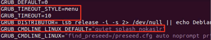
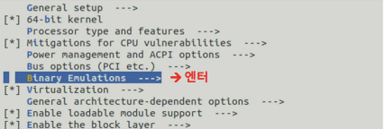
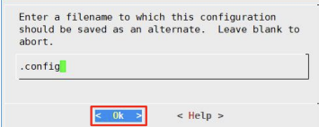

1. 프로젝트 개요 (Overview)
   -  Assignment 1-1 : Make os_ftrace system call
   -  Assignment 1-2 : Make Wrapping & hooking modules
   -  Assignment 1-3 : Make trace modules

2. 설계 및 구현 상세 (Design & Implementation)

2.1. 시스템 구조전체적인 로직의 흐름도(Flowchart)나 구조 설명

---

2.2.핵심 코드
 
**핵심 데이터 구조:** 과제에서 정의하거나 사용한 주요 구조체(struct) 설명

- **주요 함수 및 시스템 콜:** 리팩토링된 주요 함수의 역할과 인터페이스(매개변수, 반환값) 정의

---

3. 커널 수정 및 빌드 절차 (Kernel Modification & Build)

**빌드 및 설치:** 커널 소스 트리 내에서 변경하거나 추가한 파일 경로

3-1. Kernel Compile

3-2. nokalsr 설정
- Grub에서 nokalsr 설정이 되어 있는지 확인합니다. 
- KASLR (Kernel Address Space Layout Randomization)이란 커널이 부팅될 때마다 커널 코드와 데이터가 위치하는 메모리 주소를 무작위로 바꾸는 보안 기술입니다.
- Assignment1에서는 커널 주소를 직접 참조하거나 수정해야 하기 때문에 해당 설정을 꺼야 합니다.

- $ vi etc/default/grub (Grub 설정 파일 수정)
- $sudo update-grub (Grub 설정 파일 수정)

3.3. Kernel Source 다운로드
-  http://www.kernel.org 에서 다운로드를 진행합니다. ( 버전 : 5.4.282)
-  $ sudo wget https://cdn.kernel.org/pub/linux/kernel/v5.x/linux-5.4.282.tar.xz ( root 권한필요 )
- $ tar -xvf linux-5.4.282.tar.xz ( 코드 압축 해제)

3.4 Kernel Extra Version 수정 (선택)
- $ cd linux-5.4.282 
- $ vi Makefile

3.4. Kernel 환경 설정
- $ sudo apt install build-essential libncurses5-dev bison flex libssl-dev libelf-dev dwarves zstd
- $ sudo make menuconfig

(1) 커널 모듈 적재 시 발생할 수 있는 문제를 해결합니다.
- “Enable loadable module support” è “Forced module loading” 체크
- ESC 두 번 연속 입력 시 이전 메뉴로 복귀

- 

(2) 컴파일 시 문제가 될 수 있는 모듈을 제거합니다.
- “Device Drivers” -> “Staging drivers” 체크 해제

(3) 컴파일 시 문제가 될 수 있는 옵션을 제거합니다.

- “Binary Emulations” -> “x32 ABI for 64-bit mode” 체크 해제

(4) 설정을 파일(.config)에 저장합니다.

(5) 시스템 폐기키 및 보안키 비활성화
- 스크립트 활용하여 수정
- $scripts/config --disable SYSTEM_TRUSTED_KEYS
- $scripts/config --disable SYSTEM_REVOCATION_KEYS

(6) initramfs 설정 변경
- Error : initd is too big 방지를 위한 모듈 설정
- $cd /etc/initramfs-tools
- $vi initramfs.conf

3.5 재부팅
- $ reboot
- Grub 부트로더 선택 메뉴에서 컴파일한 커널 선택

- 커널 버전 확인
- $ uname -r

---

 **수행 과정:** 

---

4. 리팩토링 및 최적화 사항 (Refactoring Details)

- **이전 코드와의 차이점:** 가독성 개선, 메모리 관리 최적화, 에러 처리 강화 등 구체적인 개선 내용
- **안정성 검토:** 동기화 처리(Locking)나 사용자 영역 데이터 검증(`copy_from_user` 등) 적용 방식

---

5. 실행 결과 및 테스트 (Verification)

- **테스트 시나리오:** 구현한 기능을 검증하기 위해 작성한 테스트 케이스 설명

---

- **결과 확인:** `dmesg` 로그 기록, 테스트 프로그램 실행 화면 및 성능 측정 데이터

---

- **예외 상황 테스트:** 잘못된 입력값이나 환경에서의 에러 핸들러 동작 확인

---

6. 문제 해결 및 고찰 (Troubleshooting & Conclusion)

- **시행착오:** 커널 패닉이나 빌드 오류 발생 시 해결했던 과정

---

- **한계점 및 향후 개선 방향:** 현재 구현의 제약 사항이나 추가하고 싶은 기능

---