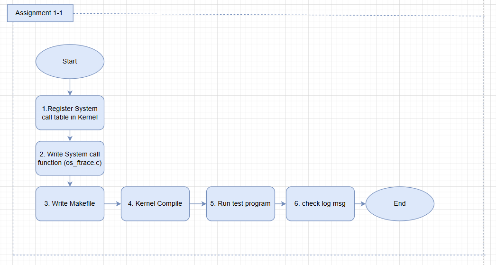
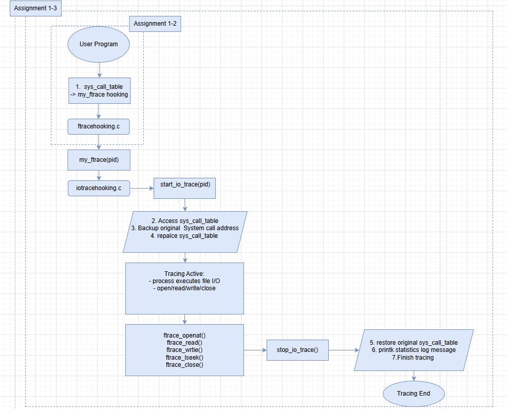
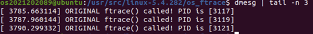
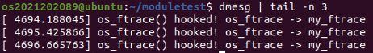
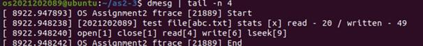

## 0. Why This Project Matters

This project directly modifies kernel internals and is intended
for educational and experimental purposes only.

By directly modifying the syscall table, I experienced
multiple kernel panics and learned how unsafe symbol
resolution can crash the entire system.

Through this process, I gained a deeper understanding
of Linux kernel internals and developed a strong habit
of defensive thinking when working with low-level systems.

> ⚠️ Note: Direct syscall table hooking is highly unsafe and
> not suitable for production systems. This approach was used
> strictly for educational purposes.

### Environment
- Linux Kernel: 5.4.282 (x86_64)
- Build: Custom kernel build
- VM: QEMU / VirtualBox
- Language: C


## 💡 1. 프로젝트 개요 (Overview)
-  Assignment 1-1 : Make os_ftrace system call
-  Assignment 1-2 : Make Wrapping & hooking modules
-  Assignment 1-3 : Make trace modules

## 2. 설계 및 구현 상세 (Design & Implementation)

### 2-1. Flowchart

📌  Assignment 1-1



<br>

📌 Assignment 1-2, 1-3



---

### 2.2. 핵심 코드
 
📌 Assignment 1-1 

- os_ftrace.c

```
// Define System call
SYSCALL_DEFINE1(os_ftrace,pid_t,pid)
{
	printk(KERN_INFO"ORIGINAL ftrace() called! PID is [%d]\n",pid);
	return 0;

}
```

📌 Assignment 1-2

- ftracehooking.c

```
/*
* hook_init
* 
* 1. Locate sys_call_table using kallsyms
* 2. Save original syscall pointer
* 3. Temporarily disable write protection
* 4. Replace syscall entry with fook function
*/
static int  __init hook_init(void)
{
	sys_call_table = (unsigned long**)kallsyms_lookup_name("sys_call_table");

	if(!sys_call_table)
	{
		printk(KERN_ERR "Couldn't find sys_call_table\n");
		return -EINVAL;
	}

	real_os_ftrace = (os_ftrace_t)sys_call_table[__NR_os_ftrace];
	printk(KERN_INFO "saving real_os_ftrace = %px\n", real_os_ftrace);

	make_rw(sys_call_table);
	sys_call_table[__NR_os_ftrace] = (unsigned long*)my_ftrace; 
	make_ro(sys_call_table);

	printk(KERN_INFO "os_ftrace hooked!\n");

	return 0;
}


/*
* hook_exit - module unload routine
* 
* Restore original syscall pointer to prevent
*/
static void __exit hook_exit(void)
{
	if (!sys_call_table || !real_os_ftrace) return;
	
	make_rw(sys_call_table);
	sys_call_table[__NR_os_ftrace] = (unsigned long*)real_os_ftrace;
	make_ro(sys_call_table);

	printk(KERN_INFO "os_ftrace restored\n");
	
}

```

📌 Assignmnet 1-3

- ftracehooking.h
```
/*
* struct io_trace_stats - I/O tracing statistics
* 
* This structure stores statistics of file I/O operations
* performed by the traced process.
* 
* Counters are increased whenever the hooked functions
* are invoked through ftracehooking.c
*/
struct io_trace_stats{
	int		open_count;		/* number of open calls */
	int		close_count;	/* number of close calls */
	int		read_count;		/* number of read calls */
	int		write_count;	/* number of write calls */
	int		lseek_count;	/* number of lseek calls */

	size_t	read_bytes;		/* total bytes read */
	size_t	write_bytes;	/* total bytes written */

	char	filename[256];	/* last accessed file name */
};

/*stats
* 
* Global I/O statistics shared between modules
* Updated by ftrace hooks during runtime
*/
extern struct io_trace_stats stats; 

```

- ftracehooking.c
```
/* ============================================================
 *  Hooked os_ftrace syscall
 * ============================================================ */
asmlinkage long my_ftrace(pid_t pid)
{
    /* stop tracing */
    if (traced_pid && pid ==traced_pid){
        stop_io_trace();
        traced_pid = 0;
	    return 0;
    } 
   
    /* start tracing */
    if (pid > 0) { 
        start_io_trace(pid);
    }

    return 0;
}
```

- iotracehooking.c
```
/* ============================================================
 *  Trace control
 * ============================================================ */

void start_io_trace(pid_t pid)
{
    traced_pid = pid;
    syscall_table = (void**) kallsyms_lookup_name("sys_call_table");

    make_rw((unsigned long)syscall_table); 

    real_openat =(void*) syscall_table[__NR_openat];
    real_read = (void*)syscall_table[__NR_read];
    real_write =(void*) syscall_table[__NR_write];
    real_lseek =(void*) syscall_table[__NR_lseek];
    real_close =(void*) syscall_table[__NR_close];

    syscall_table[__NR_openat] = ftrace_openat;
    syscall_table[__NR_read] = ftrace_read;
    syscall_table[__NR_write] = ftrace_write;
    syscall_table[__NR_lseek] = ftrace_lseek;
    syscall_table[__NR_close] = ftrace_close;

    make_ro((unsigned long)syscall_table); 

    printk(KERN_INFO "[iotrace] pid%d tracing start\n",pid);
}
EXPORT_SYMBOL(start_io_trace);

void stop_io_trace(void)
{
    if(!syscall_table) return;
 
    make_rw((unsigned long)syscall_table);

    if (real_openat) syscall_table[__NR_openat] = (void *)real_openat;
    if (real_read)   syscall_table[__NR_read]   = (void *)real_read;
    if (real_write)  syscall_table[__NR_write]  = (void *)real_write;
    if (real_lseek)  syscall_table[__NR_lseek]  = (void *)real_lseek;
    if (real_close)  syscall_table[__NR_close]  = (void *)real_close;

    make_ro((unsigned long)syscall_table);

    printk(KERN_INFO "[2021202089] %s file[%s] stats [x] read - %zd / written - %zd",
                    current->comm,stats.filename,stats.read_bytes,stats.write_bytes);
    printk(KERN_INFO "open[%d] close[%d] read[%d] write[%d] lseek[%d]",
                    stats.open_count,stats.close_count,stats.read_count,stats.write_count,stats.lseek_count);

    printk(KERN_INFO "OS Assignment2 ftrace [%d] End\n",current->pid);
}
EXPORT_SYMBOL(stop_io_trace);

```
---

## 3. 커널 수정 및 빌드 절차 

### 빌드 및 설치

#### 3-1. Kernel Compile


#### 3-2. nokaslr 설정
- Grub에서 nokaslr 설정이 되어 있는지 확인합니다. 
- KASLR (Kernel Address Space Layout Randomization)이란 커널이 부팅될 때마다 커널 코드와 데이터가 위치하는 메모리 주소를 무작위로 바꾸는 보안 기술입니다.
- Assignment1에서는 커널 주소를 직접 참조하거나 수정해야 하기 때문에 해당 설정을 꺼야 합니다.


- $ vi etc/default/grub (Grub 설정 파일 수정)
- $sudo update-grub (Grub 설정 파일 수정)


#### 3.3. Kernel Source 다운로드
-  http://www.kernel.org 에서 다운로드를 진행합니다. ( 버전 : 5.4.282)
-  $ sudo wget https://cdn.kernel.org/pub/linux/kernel/v5.x/linux-5.4.282.tar.xz ( root 권한필요 )
- $ tar -xvf linux-5.4.282.tar.xz ( 코드 압축 해제)

#### 3.4 Kernel Extra Version 수정 (선택)
- $ cd linux-5.4.282 
- $ vi Makefile


#### 3.4. Kernel 환경 설정
- $ sudo apt install build-essential libncurses5-dev bison flex libssl-dev libelf-dev dwarves zstd
- $ sudo make menuconfig


(1) 커널 모듈 적재 시 발생할 수 있는 문제를 해결합니다.
- “Enable loadable module support” è “Forced module loading” 체크
- ESC 두 번 연속 입력 시 이전 메뉴로 복귀


- 

(2) 컴파일 시 문제가 될 수 있는 모듈을 제거합니다.
- “Device Drivers” -> “Staging drivers” 체크 해제


(3) 컴파일 시 문제가 될 수 있는 옵션을 제거합니다.

- “Binary Emulations” -> “x32 ABI for 64-bit mode” 체크 해제


(4) 설정을 파일(.config)에 저장합니다.


(5) 시스템 폐기키 및 보안키 비활성화
- 스크립트 활용하여 수정
- $ scripts/config --disable SYSTEM_TRUSTED_KEYS
- $ scripts/config --disable SYSTEM_REVOCATION_KEYS


(6) initramfs 설정 변경
- Error : initd is too big 방지를 위한 모듈 설정
- $ cd /etc/initramfs-tools
- $ vi initramfs.conf


#### 3.5 재부팅
- $ reboot
- Grub 부트로더 선택 메뉴에서 컴파일한 커널 선택


- 커널 버전 확인
- $ uname -r


---

<br>

## 4. 리팩토링 및 최적화 사항 

#### 목표
- 코드 가독성 향상 및 커널 안정성 확보
- 중복 로직 제거 및 함수 단위 기능 분리

#### 주요 수정 사항

#### Assignment 1-2: Process Tracer

-  중복된 ftrace wrapper 제거
-  불필요한 __SYSCALL_DEFINEX 사용 제거
-  하드코딩된 syscall 번호(336) 상수화
-  syscall index 의존성 명확화
-  로그 메시지 통일
-  make_rw / make_ro 안정성 강화
-  함수 선언 위치 정리
-  static / const 정확히 사용
-  커널 코딩 컨벤션 정렬

#### Assignment 1-3: Process Tracer

- 중복 코드 정리
- 시스템 콜 매직 넘버 제거
- 함수 포인터 타입 추상화 (typedef)
- 후킹 로직 흐름 구조 개선
- 디버그 로그 정리 및 최소화
- 전역 통계 구조 초기화 위치 개선
- 코드 스타일 및 주석 형식 통일

---

## 5. 실행 결과 및 테스트 

📌 Assignment 1-1

#### 0) 기본 경로
```
home/linux-5.4.282
```

#### 1) System call table 등록
```
$ sudo cd /linux-5.4.282 
$ sudo vi arch/x86/entry/syscalls/syscall_64.tbl # 시스템 콜 테이블 등록
$ sudo vi linux-5.4.282/include/linux/syscalls.h # 시스템 콜 테이블 등록
```

#### 2) System Call 함수 작성 (os_ftrace.c)
```
$ sudo mkdir linux-5.4.282/os_ftrace
$ sudo vi os_ftrace/os_ftrace.c
```

#### 3) System call 함수에 대한 Makefile 작성
```
$ sudo vi os_ftrace/Makefile
```

#### 4) 커널 컴파일 
```
$ sudo make -j3
$ sudo make modules_install
$ sudo make install
```

#### 5) 방금 컴파일 한 커널로 부팅
```
$ sudo reboot
```

#### 5) 테스트 프로그램 작성
```
$ sudo vi os_ftrace/test.c
$ sudo gcc test.c -o test
$ sudo ./test
```

```
#include <stdio.h> /* printf() */
#include <unistd.h> /* syscall() */
#include <sys/syscall.h> /* syscall() */

int main(void)
{
        pid_t pid = getpid();
        long ret;

        ret = syscall(548,pid);
        printf("%ld\n",ret);

        return 0;
}     
```

#### 6) 로그 확인
```
$ dmesg | tail -n 3
```



---

📌 Assignment 1-2
#### 0) 기본 경로
```
home/as1-2
```


#### 1) 모듈 소스 프로그램 작성 – os_ftracehooking.c - os_ftrace 시스템콜 hijack하여 my_ftrace함수로 대체하는 툴

```
$ cd  # 홈으로 이동
$ mkidr moduletest
$ vi os_ftracehooking.c
```

#### 2) 모듈 소스 프로그램 작성 - Makefile 작성
```
$ vi Makefile
```

#### 3) 소스 컴파일
```
$ make clean && make
```

#### 4) 테스트 프로그램 작성
```
$ vi test.c

```

```
#include <stdio.h> /* printf() */
#include <unistd.h> /* syscall() */
#include <sys/syscall.h> /* syscall() */

int main(void)
{
        pid_t pid = getpid();
        long ret;

        ret = syscall(548,pid);
        printf("%ld\n",ret);

        return 0;
}     
```

#### 5) 모듈 적재
```
$ sudo insmod os_ftracehooking.ko
```

#### 6) 모듈 동작 확인
```
$ ./test
```

#### 7) 모듈 제거 
```
$ sudo rmmod os_ftracehooking # 모듈 제거
$ lsmod | grep os_ftracehooking # 제거됐는지 확인
```

#### 8) 로그 확인
```
$ dmesg | tail -n 3
```

---

📌 Assignment 1-3

#### 0) 기본 경로
```
home/as1-3
```

#### 1) ftracehooking.h 작성 - 구조체 정의
```
$ mkdir as1-3
$ vi ftracehooking.h
```

#### 2) ftracehooking.c 작성 - os_ftrace 시스템콜 hijack하여 my_ftrace함수로 대체하는 툴
```
$ vi ftracehooking.c
```

#### 3) iotracehooking.c 작성 - 특정 pid에 대하여 파일에 관한 시스템콜을 추적하는 툴
```
$ vi iotracehooking.c
```

#### 4) Makefile 작성
```
$ vi Makefile
```

#### 5) 소스 컴파일
```
$ make clean && make
```

#### 6) 모듈 적재
```
$ sudo insmod iotracehooking.ko
$ sudo insmode ftracehooking.ko
```

#### 7) 모듈 적재 확인
```
$ lsmod | grep hooking
```
#### 8) 테스트 프로그램 작성 및 실행
```
$ vi test.c
$ ./test
```

```
#include <sys/stat.h>
#include <fcntl.h>
#include <stdlib.h>
#include <unistd.h>
#include <string.h>
#include <sys/syscall.h>

int main()
{
        long pid = getpid();
        syscall(548,pid);  // 커널 모듈에 pid 전달
        int fd = 0;
        char buf[50];
        fd  = open("abc.txt",O_RDWR);
        if(fd<0)
        {
                perror("open");
                return 1;
        }

        for(int i = 1; i<=4;i++)
        {
                read(fd,buf,5); // 파일에서 5바이트 읽음
                lseek(fd,0,SEEK_END); // 파일 끝으로 이동
                write(fd,buf,5); // 읽은 5바이트를 파일 끝에 기록
                lseek(fd,i*5,SEEK_SET); // 파일 포인터를 i*5 위치로 설정
        }
        lseek(fd,0,SEEK_END);
        write(fd,"HELLO",strlen("HELLO"));
        close(fd);

        printf("Calling os_ftrace(0)...\n");
        fflush(stdout);
        syscall(548,0);
        sleep(1);
        printf("Finished test.\n");
        return 0;
}


```

#### 9) 모듈 제거
```
$ sudo rmmod ftracehooking.ko
$ sudo rmmod iotracehooking.ko
```
#### 10) 로그 확인
```
$ dmesg | tail -n 4
```


---

## 6. 문제 해결 및 고찰 (Troubleshooting & Conclusion)

### 6-1. 문제 발생 및 원인 분석
과제 1-3의 테스트 프로그램(./test) 실행 시, "CPU disabled by guest" 메시지와 함께 가상 머신(VM)이 중단되는 현상이 발생하였다. dmesg를 통한 커널 로그 분석 결과, 해당 현상은 Kernel Panic에 의한 것으로 확인되었다.

원인은 기존 iotracehooking.c의 원본 함수 주소 획득 방식에 있었다. kallsyms_lookup_name()을 이용해 __x64_sys_openat 등 개별 시스템 콜 심볼을 직접 검색하여 참조하였으나, 이 과정에서 유효하지 않은 함수 포인터 주소가 반환되었다. 이로 인해 권한 레벨 0(Kernel Mode)에서 CPU가 잘못된 명령(Invalid Instruction)을 실행하려고 시도하면서 시스템이 보호를 위해 동작을 멈춘 것으로 판단된다.

### 6-2. 해결 
기존 코드에서는 kallsyms_lookup_name을 호출하여 각 시스템 콜의 심볼 이름(__x64_sys_openat 등)을 직접 찾아 원본 주소를 저장했습니다. 하지만 최신 커널 환경이나 특정 아키텍처에서는 심볼 이름과 실제 실행되는 시스템 콜 핸들러 간의 불일치가 발생할 수 있으며, 이로 인해 유효하지 않은 주소를 호출하게 되어 CPU의 General Protection Fault 혹은 Kernel Panic이 유발되었습니다.

이를 해결하기 위해, 이미 안정적으로 확보한 sys_call_table의 해당 인덱스(__NR_xxx)에 저장된 값을 직접 읽어오는 방식으로 변경하였습니다. 이 방식은 커널이 시스템 콜을 처리할 때 사용하는 실제 테이블의 값을 1:1로 백업하므로, 심볼 이름 불일치 문제를 원천적으로 차단하고 안정적인 복구(Restore)를 보장합니다.

### 6-3. 문제가 발생한 코드 (iotracehooking.c)

```
void start_io_trace(pid_t pid)
{
    traced_pid = pid;
    syscall_table = (void**) kallsyms_lookup_name("sys_call_table");

    make_rw((unsigned long)syscall_table); 
   /* ============================ 문제가 발생한 부분 ========================== */
    real_openat =(void*)kallsyms_lookup_name("__x64_sys_openat);
    real_read = (void*)kallsyms_lookup_name("__x64_sys_read);
    real_write =(void*) kallsyms_lookup_name("__x64_sys_write);
    real_lseek =(void*) kallsyms_lookup_name("__x64_sys_lseek);
    real_close =(void*) kallsyms_lookup_name("__x64_sys_close);
   /* ======================================================================== */
    syscall_table[__NR_openat] = ftrace_openat;
    syscall_table[__NR_read] = ftrace_read;
    syscall_table[__NR_write] = ftrace_write;
    syscall_table[__NR_lseek] = ftrace_lseek;
    syscall_table[__NR_close] = ftrace_close;

    make_ro((unsigned long)syscall_table); 

    printk(KERN_INFO "[iotrace] pid%d tracing start\n",pid);
}

EXPORT_SYMBOL(start_io_trace);

void stop_io_trace(void)
{
    if(!syscall_table) return;
 
    make_rw((unsigned long)syscall_table);
   /* ============================ 문제가 발생한 부분 ========================== */
    if (real_openat) syscall_table[__NR_openat] = (void *)real_openat;
    if (real_read)   syscall_table[__NR_read]   = (void *)real_read;
    if (real_write)  syscall_table[__NR_write]  = (void *)real_write;
    if (real_lseek)  syscall_table[__NR_lseek]  = (void *)real_lseek;
    if (real_close)  syscall_table[__NR_close]  = (void *)real_close;
   /* ======================================================================== */
    make_ro((unsigned long)syscall_table);

    printk(KERN_INFO "[2021202089] %s file[%s] stats [x] read - %zd / written - %zd",
                    current->comm,stats.filename,stats.read_bytes,stats.write_bytes);
    printk(KERN_INFO "open[%d] close[%d] read[%d] write[%d] lseek[%d]",
                    stats.open_count,stats.close_count,stats.read_count,stats.write_count,stats.lseek_count);

    printk(KERN_INFO "OS Assignment2 ftrace [%d] End\n",current->pid);
}
EXPORT_SYMBOL(stop_io_trace);

```


### 6-4. 해결된 코드 (iotracehooking.c)

```
void start_io_trace(pid_t pid)
{
    traced_pid = pid;
    syscall_table = (void**) kallsyms_lookup_name("sys_call_table");

    make_rw((unsigned long)syscall_table); 
   /* ============================ 수정된 부분 ========================== */
    real_openat =(void*) syscall_table[__NR_openat];
    real_read = (void*)syscall_table[__NR_read];
    real_write =(void*) syscall_table[__NR_write];
    real_lseek =(void*) syscall_table[__NR_lseek];
    real_close =(void*) syscall_table[__NR_close];

    syscall_table[__NR_openat] = ftrace_openat;
    syscall_table[__NR_read] = ftrace_read;
    syscall_table[__NR_write] = ftrace_write;
    syscall_table[__NR_lseek] = ftrace_lseek;
    syscall_table[__NR_close] = ftrace_close;
   /* ================================================================== */
    make_ro((unsigned long)syscall_table); 

    printk(KERN_INFO "[iotrace] pid%d tracing start\n",pid);
}

EXPORT_SYMBOL(start_io_trace);

void stop_io_trace(void)
{
    if(!syscall_table) return;
 
    make_rw((unsigned long)syscall_table);

    if (real_openat) syscall_table[__NR_openat] = (void *)real_openat;
    if (real_read)   syscall_table[__NR_read]   = (void *)real_read;
    if (real_write)  syscall_table[__NR_write]  = (void *)real_write;
    if (real_lseek)  syscall_table[__NR_lseek]  = (void *)real_lseek;
    if (real_close)  syscall_table[__NR_close]  = (void *)real_close;

    make_ro((unsigned long)syscall_table);

    printk(KERN_INFO "[2021202089] %s file[%s] stats [x] read - %zd / written - %zd",
                    current->comm,stats.filename,stats.read_bytes,stats.write_bytes);
    printk(KERN_INFO "open[%d] close[%d] read[%d] write[%d] lseek[%d]",
                    stats.open_count,stats.close_count,stats.read_count,stats.write_count,stats.lseek_count);

    printk(KERN_INFO "OS Assignment2 ftrace [%d] End\n",current->pid);
}
EXPORT_SYMBOL(stop_io_trace);
```

---

## 7. 한계점 및 향후 개선 방향

### 7-1. 한계점

- 성능 오버헤드: 모든 시스템 콜을 후킹하여 통계를 쌓는 방식이 시스템 전체 성능(Throughput)에 미치는 영향.
- Race Condition: 여러 프로세스가 동시에 후킹된 기능을 사용할 때 stats 구조체(전역 변수)에 대한 동기화 문제.
- 커널 버전 의존성: 특정 커널 버전(5.4.282)에 종속적인 구조(syscall table 위치 등)에 대한 한계.

### 7-2: 개선 방향

-  Docker 컨테이너 기반의 커널 빌드 자동화 환경 구축 및 QEMU 연동을 통한 독립적인 커널 모듈 테스트 샌드박스 구현


---