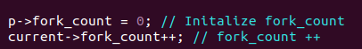
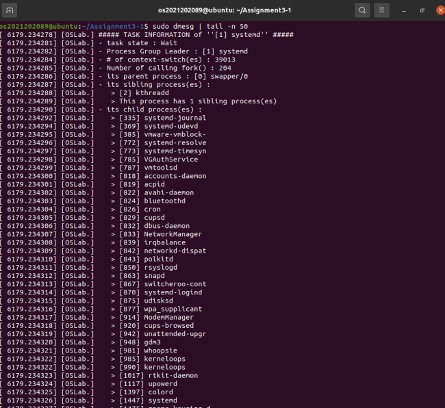
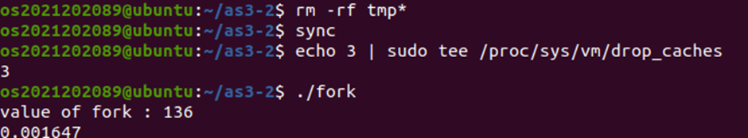
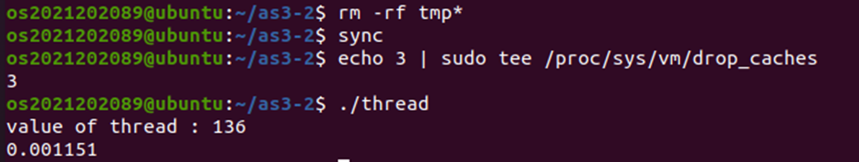
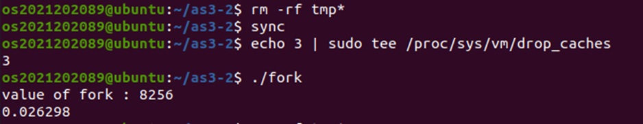
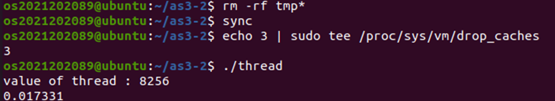
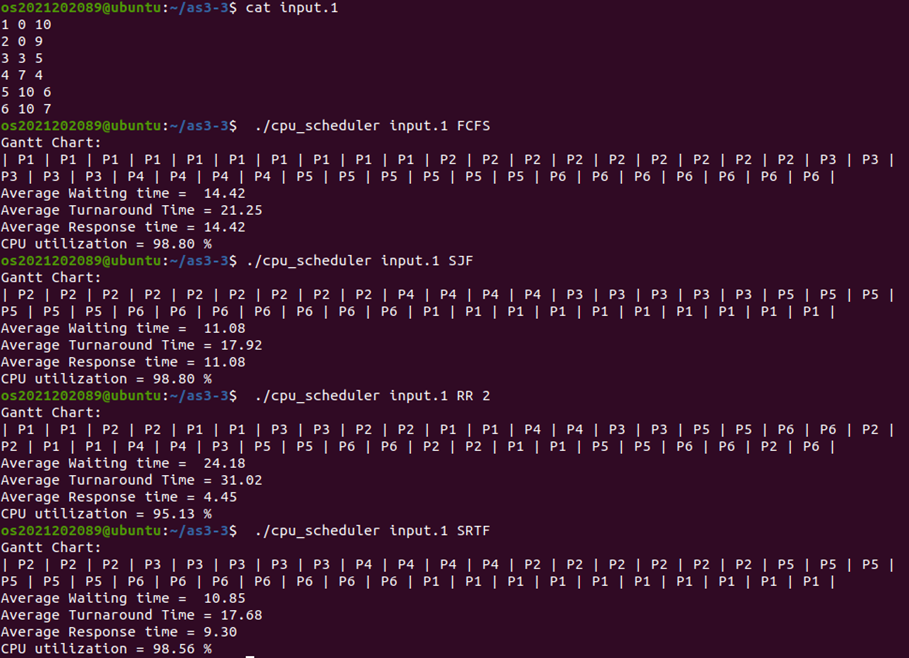
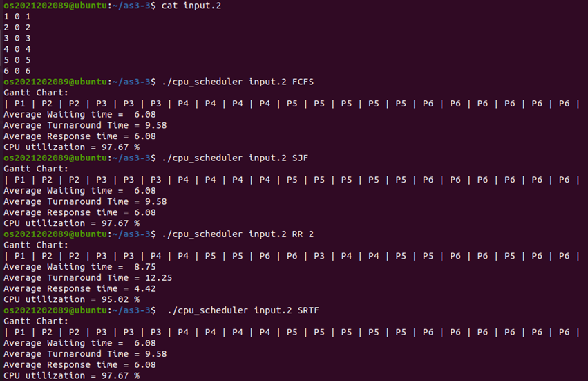
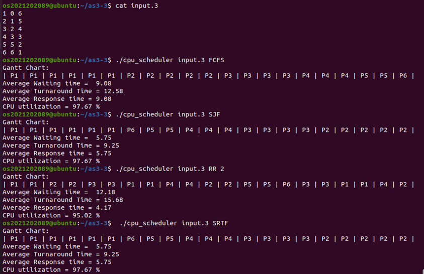

## Introduction
📌 Assignment 2-1 
- Assignment1 에서 작성한 ftrace 시스템콜에 대해서 Process_tracer.c 를 작성하여, asmlinkage pid_t process_tracer(pid_t trace_task) 함수로 wrapping 하여 사용하면 된다. 

- 이때, 커널 소스코드를 수정하여 fork()를 호출한 횟수를 구현해야 한다.

- 또한 Kernel ring buffer 에  { 현재 프로세스의 상태, Context switch 횟수 ,부모 프로세스 정보, 형제 프로세스 정보, 자식 프로세스 정보 }을 포함하여 출력하면 된다. 

<br>

📌 Assignment 2-2 
- 우선 생성한 프로세스/ 스레드의 수의 2 배만큼 i 번째 값을 정수형 양수로 기록하기 위해서 ./temp.txt 를 생성하여 이를 기록하는 numgen.c 를 작성한다. 

- 다음으로 다중 프로세스를 생성하여, 최상단 프로세스마다 2 개의 숫자를 읽고, 각 프로세스는 두개의 숫자를 더한 후 부모 프로세스에게 값을 전달 한뒤, 최종적으로 나온 값 과 전체 프로그램 수행시간을 측정하는 fork.c 를 작성한다.

- 또한 이를 스레드로 수행하는 프로그램 또한 thread.c 로 작성한 뒤 Makefile 을 통해서, 결과에 대한 분석 내용을 작성하면 된다.

<br>

📌 Assignment 2-3
 -  도착 시간(Arrival Time) 과 실행 시간(Burst Time) 을 바탕으로, 여러 CPU 스케줄링 알고리즘을 직접 구현하고 그 결과를 비교해야 한다. 

 - 구현해야 하는 스케줄링 알고리즘은 다음과 같다.
    - FCFS(First Come First Served)
    - SJF(Shortest Job First)
    - SRTF(Shortest Remaining Time First)
    -  RR(Round Robin) 

- 각 알고리즘은 동일한 입력 데이터에 대해서 Gantt Chart를 사용하여
Average Waiting Time, Average Turnaround Time, Average Response Time, CPU Utilization 값을 출력해야 하며, 알고리즘간 성능 차이를 수치적으로 비교 및 분석한다.

---

## 동작과정

📌 Assignment 2-1

#### [모듈 로드 시]
module_init() 함수에서 sys_call_table 주소를 획득하고, sys_call_table[336] 항목을 os_ftrace_trampoline() 함수로 후킹한다. 
#### [실행 시]
User Space	
-> syscall(336, pid)

-> System Call Table (336번 entry)

-> os_ftrace_trampoline() <- wrapping

-> process_tracer(pid)

-> 커널 로그(dmesg)에 프로세스 정보 출력

#### [모듈 제거 시]
module_exit() 함수에서 sys_call_table[336]을 원래 함수로 복원한다.

<br>

📌 Assignment 2-2

Step 1. MAX_PROCESSES 만큼 프로세스 또는 스레드를 생성 ( MAX_PROCESSES = 8, 64 )

Step 2. 최상단 프로세스/스레드마다 2 개의 숫자를 읽음.

Step 3. 각 프로세스/스레드는 두 개의 숫자를 더한 후, 부모 프로세스/스레드에게 값을 전달 ( fork à exit() 사용)

Step 4. 최종적으로 나온 값, 전체 프로그램 수행시간 측정

<br>

📌 Assignment 2-3

각 테스트 케이스에 대해서, FCFS/SRTF/SJF/RR 수행 후 간트차트 출력.

---

## 결과화면

📌 Assignment 2-1

#### 1) task_struct 에 fork 호출 횟수를 저장하는 변수를 추가합니다. (커널 코드 수정)

```
cd usr/src/linux-5.4.282
sudo vi include/linux/sched.h # 
```


#### 2) fork()로 자식 프로세스를 생성할 때마다 해당 변수를 초기화합니다. (커널 코드 수정)

```
cd usr/src/linux-5.4.282
sudo vi init/init_task.c
```


#### 3) fork()가 호출될 때마다 해당 변수의 값을 1씩 증가시킵니다. (커널 코드 수정)

```
cd usr/src/linux-5.4.282
sudo vi kernel/fork.c
```


#### 4) 커널 소스코드가 수정되었으므로, 커널 컴파일 후 재부팅
```
sudo make -j3 
sudo make modules_install
sudo make install
sudo reboot
```

#### 5) Wrapping 모듈로 사용할 Process_tracer.c 작성

```
mkdir Assignment2-1
vi Process_tracer.c
```

#### 6) Makefile 작성 및 Make
```
vi Makefile
make
```

#### 7) 커널에 모듈을 로드합니다.
```
sudo insmod Process_tracer.ko
```

#### 8) 테스트 프로그램 작성
```
vi test.c
gcc test.c -o test  # 테스트 코드 컴파일 
./test 1            # PID 1의 정보를 커널 버퍼에 기록 
```

#### 9) 커널 로그 출력 확인
```
dmesg | tail -n 50
```



→ PID를 바탕으로, (1) 프로세스 이름, (2) 현재 프로세스의 상태, (3) 프로세스 그룹 정보, (4) 해당 프로세스를 실행하기 위해 수행된 context switch 횟수, (5) fork()를 호출한 횟수,(6)부모 프로세스 정보 , (7)형제자매 프로세스 정보, (8)자식 프로세스 정보가 출력되는 것을 확인할 수 있습니다.

---

📌 Assignment 2-2

#### 1) numgen.c 작성

```
mkdir Assignment2-2
cd Assignment 2-2
vi numgen.c
```
특정 파일 ./temp.txt 를 생성하고, 파일에서 i 번째 값을 integer 형 양수으로 생성할
프로세스 수의 2 배만큼(MAX_PROCESSES) 기록하는 nungen.c 코드를 작성합니다.

#### 2) fork.c , numgen.c 작성
```
vi fork.c
vi thread.c
```

#### 3) Makefile 작성

```
vi Makefile
```
- Makefile 은 MAX_PROCESSES 값을 매크로 형태로 프로그램에 전달하여 프로세스/스레드 수를 쉽게 조정할 수 있도록 구성됩니다.
- make 명령을 통해 기본(8 개) 버전 빌드가 가능하고, make all64 명령을 통해 64 개 버전 실행 파일을 자동으로 생성할 수 있습니다. 
- 또한, run 및 clean 규칙을 통해 실행 및 파일 정리를 손쉽게 수행할 수 있도록 작성하였습니다.

#### 4) 테스트
```
# MAX_PROCESSES = 8 (프로세스 / 스레드 수)

# make 및 temp.txt 생성
make clean && make
./numgen 

# 실험마다 캐시 및 버퍼를 비우는 명령어를 수행하여, 문제가 발생하지 않게 합니다.
rm -rf tmp*
sync
echo 3 | sudo tee /proc/sys/vm/drop_caches
./fork

# 실험마다 캐시 및 버퍼를 비우는 명령어를 수행하여, 문제가 발생하지 않게 합니다.
rm -rf tmp*
sync
echo 3 | sudo tee /proc/sys/vm/drop_caches
./thread
```



- fork 방식과 thread 방식 모두 1 + 2 + ... + (2×MAX) = n(n+1)/2, (MAX=8 일때)

- n=16	→ 16×17/2 = 136 으로 알맞게 나오는 것을 확인 할 수 있다.

- fork = 0.001647s , thread = 0.001151s 로 스레드가 약 1.4 배 빠르다

<br>

```
# MAX_PROCESSES = 64 (프로세스 / 스레드 수)

# make 및 temp.txt 생성
make clean && make all64
./numgen 

# 실험마다 캐시 및 버퍼를 비우는 명령어를 수행하여, 문제가 발생하지 않게 합니다.
rm -rf tmp*
sync
echo 3 | sudo tee /proc/sys/vm/drop_caches
./fork

# 실험마다 캐시 및 버퍼를 비우는 명령어를 수행하여, 문제가 발생하지 않게 합니다.
rm -rf tmp*
sync
echo 3 | sudo tee /proc/sys/vm/drop_caches
./thread
```



- 두 방식 모두 temp.txt 의 1 ~ 128 을 모두 더한 값이므로, 8256 으로 동일하다. 이를 통해 각 프로세스/스레드가 올바르게 분할 계산하고 값을 전달했음을 알 수 있다.

- 스레드 방식(thread) 의 수행 시간이 fork 방식보다 약 1.5 배 빠르다. 이는 fork() 는 각 자식 프로세스를 생성할 때 부모의 메모리 공간을 복사해야 하므로, 프로세스 생성 오버헤드가 크다.

- 이와 달리 스레드 방식에서 pthread() 는 동일한 주소 공간을 공유하며, 스택만 별도로 할당되므로 Context Switch 비용이 작고 메모리 효율이 높음.

<br>

#### 5) 결과 분석

a.	최종적으로 나온 값

MAX_PROCESSES = 8 인 경우 입력으로 사용된 정수의 범위가 1 부터 16 까지이므로, 각 프로세스/스레드가 두 개씩 값을 더한 결과를 모두 합산하면 최종 결과는 136 이 된다.
MAX_PROCESSES = 64 인 경우 입력 범위가 1 부터 128 까지로 확장되며 동일한 방식으로 합산될 때 최종 결과는 8256 이 된다.

b.	스레드 방식의 우위

측정 결과, 스레드 방식이 프로세스 방식 대비 약 1.4~1.5 배 더 빠른 성능을 보였습니다. 즉, 스레드를 사용했을 때 총 실행 시간이 프로세스보다 짧게 측정되었습니다.
이러한 성능 차이는 주로 프로세스 생성 overhead 와 context switch 비용에서 기인합니다.
process: 새 프로세스는 독립적인 주소 공간과 커널 자원(페이지 테이블, 파일 디스크립터 등)을 생성하거나 복제해야 하므로, 생성 과정(fork 시간)에 높은 비용이 발생합니다.
thread: 스레드는 주소 공간을 공유하며 최소한의 실행 상태(스택, 레지스터)만 생성하므로, 프로세스 생성에 비해 오버헤드가 훨씬 가볍습니다.

c.	일관된 스레드의 우위

MAX_PROCESSES 가 8 에서 64 로 증가했음에도 불구하고, 두 방식 간의 성능 비율(1.4 배 ,1.5 배)은 유사하게 유지됩니다. 이는  동시 실행 개수(N)가 증가함에 따라, 두 방식 모두 오버헤드 역시 선형적으로 증가합니다. 프로세스 방식의 높은 오버헤드가 N 배로 증가하고, 스레드 방식의 낮은 오버헤드가 N 배로 증가하면서, 두 오버헤드의 비율 자체는 N 값과 무관하게 안정적으로 유지됩니다.

d.	결론

결론적으로, 스레드가 프로세스 대비 약 1.4~1.5 배로 더 빠른 것은 OS 자원 생성 및 전환 비용 차이 때문이며, N 의 변화에도 이 비율이 유지되는 것은 생성/스케줄링 오버헤드가 전체 시간에 지배적이기 때문입니다.

e. 실험 전 캐시 초기화

프로그램 실행 시간은 page cache, directory entry cache, inode 캐시등의 영향을 받는다. 따라서 이를 제거하기 위해 다음의 3 개 명령어를 수행해야한다.
- rm -rf tmp*
- sync
- echo 3 | sudo tee /proc/sys/vm/drop_caches

이를 통해 I/O 캐시가 초기화된 동일한 환경에서 각 실행을 비교할 수 있다.
 
f. exit() 값의 8 비트 제한

자식 프로세스의 exit() 반환 값은 커널 내부적으로 8 비트로 저장된다.
따라서 256 이상의 값은 상위 비트가 손실되며, (value & 0xFF) 또는 (value >> 8) 처리를 통해 올바른 값을 전달해야 한다. 이는 리눅스의 wait() 시스템 콜이 하위 8 비트만을 WEXITSTATUS(status)로 반환하기 때문이다.

<br>

📌 Assignment 2-3

#### 1) cpu_scheduler.c 작성
```
mkdir Assignment2-3
cd Assignment2-3
vi cpu_scheduler.c
```

#### 2) Makefile 작성 및 make
```
vi Makefile
make clean && make
```

#### 3) 테스트

- Test case 01



- Test case 02


 
- Test case 03



#### 4) 각 알고리즘별 성능 분석

- Test case 01

| | Average Waiting time | Average Turnaround time | Average Response time | CPU Utilization |
| :--- | :---: | :---: | :---: | :---: |
| **FCFS** | 14.42 ms | 21.25 ms | 14.42 ms | 98.80 % |
| **SJF** | 11.08 ms | 17.92 ms | 11.08 ms | 98.80 % |
| **SRTF** | 10.85 ms | 17.68 ms | 9.30 ms | 98.56 % |
| **RR** | 24.18 ms | 31.02 ms | 4.45 ms | 95.13 % |

<br>

- Test case 02

| | Average Waiting time | Average Turnaround time | Average Response time | CPU Utilization |
| :--- | :---: | :---: | :---: | :---: |
| **FCFS** | 6.08 ms | 9.58 ms | 6.08 ms | 97.67 % |
| **SJF** | 6.08 ms | 9.58 ms | 6.08 ms | 97.67 % |
| **SRTF** | 6.08 ms | 9.58 ms | 6.08 ms | 97.67 % |
| **RR** | 8.75 ms | 12.25 ms | 4.42 ms | 95.02 % |

<br>

- Test case 03

| | Average Waiting time | Average Turnaround time | Average Response time | CPU Utilization |
| :--- | :---: | :---: | :---: | :---: |
| **FCFS** | 9.08 ms | 12.58 ms | 9.08 ms | 97.67 % |
| **SJF** | 5.75 ms | 9.25 ms | 5.75 ms | 97.67 % |
| **SRTF** | 5.75 ms | 9.25 ms | 5.75 ms | 97.67 % |
| **RR** | 12.18 ms | 15.68 ms | 4.17 ms | 95.02 % |

<br>

본 실험에서는 동일한 프로세스 집합(input1 ,input2 ,input3)에 대해 FCFS, SJF, RR, SRTF 스케줄링 알고리즘을 적용하고, 각 알고리즘의 평균 대기 시간(Waiting Time), 평균 반환 시간(Turnaround Time),평균 응답 시간(Response Time), CPU 활용도를 비교하였습니다.

- Test case 01 분석

    - SRTF 가 가장 낮은 대기 시간과 반환 시간, 응답 시간을 보여 가장 효율적이다.
    - RR 은 응답 시간은 가장 빠르지만, Time Quantum 으로 인해 Context Switching 오버헤드가 발생하여 , 대기 시간과 반환 시간이 크게 증가하였다.
    - FCFS 는 작업 순서에 의존하기 때문에 Convoy(호위) 효과로 인해 성능이 떨어진다.
    - SJF 는 비선점 방식이지만 평균 대기 시간과 반환 시간이 FCFS 와 대비해서, 효율적이다. ( Shortest Job First 특성)

- Test case 02 분석

    - FCFS, SJF, SRTF 가 모두 동일한 결과를 보이고 있는데, input.2 의 입력값에 대해서
이는 모든 프로세스의 도착 시간이 0 으로 동일하고, Burst Time 또한 단조적으로 증가하는 형태라서, Ready Queue 에 처음부터 모든 프로세스가 동시에 존재한다, , 이에 따라 SJF,SRTF 가 FCFS 와 동일한 순서로 실행되었기 때문에 동일한 결과를 보인다.
    - RR 은 응답 시간은 짧지만, Context Switching 으로 인해 Average Turnadround time 이 증가하였다.
    - 그리고 Test case02 를 통해서, 프로세스 실행 시간이 균일하면 FCFS 도 충분히 효율적으로 동작할 수 있다는 점을 알 수 있다.

- Test case 03 분석

    - Test Case 03 에서는 프로세스마다 Burst Time(실행 시간)의 편차가 크기 때문에, 스케줄링 알고리즘에 따라 성능 차이가 뚜렷하게 나타난다.
    - 먼저 FCFS(First-Come First-Served) 은 도착 순서대로 실행을 진행하므로, 긴 실행 시간을 가진 프로세스가 먼저 실행될 경우 후순위 프로세스들이 장시간 대기해야 한다. 따라서 평균 대기 시간(Waiting Time)과 반환 시간(Turnaround Time)이 상대적으로 크게 나타난다.

    - SJF/ SRTF 에 대해서, SJF 는 현재 시점에 도착해 있는 프로세스 중 Burst time 이 가장 짧은 프로세스 를 선택하고, SRTF 는 선점 방식으로 실행 도중이라도 새로 들어온 프로세스가 실행 시간이 더 짧으면 선점한다. 그런데 input.3 에서는 실행중인 프로세스의 남은 시간보다 더 짧은 Burst Time 을 가진 프로세스가 도착할 수가 없어서 (도착 시간과 Burst 의 대칭적인 증가/감소 구조)로 인해 SRTF 가 선점하는 상황이 나오지 않는다. 따라서 두 알고리즘 모두 동일한 순서를 따르게 되고, 결과도 동일하게 나온다.
    - 한편, RR(Round Robin) 은 Time Quantum 단위로 CPU 를 순환 배분하기 때문에, 응답 시간(Response Time)은 가장 짧게 유지되지만, Context Switching 이 빈번하게 발생한다. 이로 인해 대기 시간과 반환 시간은 다른 알고리즘보다 가장 비효율적인 결과를 보인다


- 종합 결론 

    - 본 실험을 통해 프로세스 스케줄링 알고리즘은 작업 도착 시점과 실행 시간(Burst Time)의 분포에 따라 성능 차이가 명확하게 나타난다는 것을 확인할 수 있었다.
    - SRTF 는 작업 실행 시간을 동적으로 고려하고 필요 시 선점을 수행하기 때문에, 대기 시간·반환 시간·응답 시간 측면에서 가장 효율적인 알고리즘임을 확인하였다.
    - SJF 는 선점이 없다는 점에서 SRTF 보다는 유연성이 떨어지지만,
Burst Time 편차가 존재하는 작업 집합(input1,input3)에서 FCFS 대비 성능 향상 효과가 확실하게 나타났다.
    - FCFS 는 구현이 단순하지만, 실행 시간이 긴 작업이 먼저 도착하는 경우 Convoy Effect(호위 효과) 로 인해 전체 성능이 악화될 수 있다.
    - RR 스케줄링은 응답 시간 측면에서 가장 우수하지만,
Time Quantum 단위의 잦은 Context Switching 오버헤드로 인해 대기 시간과 반환 시간이 증가하는 단점이 있다.또한 입력 데이터가 동시에 도착하거나 실행 시간이 균일한 경우 (input2 경우),
SJF / SRTF / FCFS 가 동일한 스케줄링 결과를 나타낼 수 있음을 Test Case 02 를 통해 확인하였다. 반면, Burst Time 에 차이가 존재하는 경우, SJF/SRTF 는 FCFS 대비 확실한 성능 이점을 보였다.

    - 따라서, 스케줄링 알고리즘의 선택은 프로세스들의 도착 시점과 실행 시간 분포에 따라 달라져야 하며, CPU 집중형 작업이 다양한 환경에서는 SRTF 가 가장 효율적이고,
응답 속도가 중요한 시스템에서는 RR 이 적합하다는 점을 확인할 수 있다.


---


## 고찰 

- Assignment 2를 진행하면서, 단순한 사용자 레벨 프로그램이 아니라 운영체제 내부의 동작 방식을 직접 다룬다는 것이 얼마나 복잡하고 미세한 요소에 의해 좌우되는지 알 수 있었다.
- 2-1 에서 fork_count 를 커널에 추가하고 system call wrapping 을 구현할 때, sys_call_table 수정으로 인한 커널 패닉(Kernel Panic) 을 여러 번 겪었는데, 이러한 상황이 발생할때마다 다시 수정하고 커널 컴파일을 해야되는데, 이때 커널 컴파일이 너무 오래 걸려서, 상당히 머리가 아팠던 것 같다. 이 경험을 통해 커널 공간의 수정은 단 한 줄의 실수도 허용되지 않는다는 것을 배웠다. 또한 pt_regs 기반으로 system call wrapper 를 구성하면서 사용자 레벨에서 전달되는 인자가 커널 내부에서는 어떻게 처리되는지를 명확히 이해할 수 있었다.
- 2-2 에서는 프로세스 생성과 스레드 생성의 비용 차이를 실험적으로 비교해보면서, 문서로만 보던 스레드가 상대적으로 가볍다는 개념이 실제 실행 시간에서도 명확히 드러난다는 것을 확인했다. 특히 캐시 및 파일시스템 버퍼가 측정 결과에 영향을 준다는 점에서, 정확한 실험 환경을 통제하는 것이 실험 분석에서 매우 중요함을 배울 수 있었다.
- 2-3 에서는 스케쥴러 알고리즘 FCFS,SJF,SRTF,RR 을 C 언어를 통해서, 구현해야 됐는데, 확실히 이론을 구체적인 코드로 옮기는 과정은 상당히 복잡한 과정인 것같다. 그래도 이를 통해서, 스케줄러 알고리즘의 특징과 성능 차이를 수치적으로 비교해보면서, 이론 시간에 이해했던 알고리즘들을 실제 실행 결과로 연결해 볼수 있었다. 동일한 입력에서도 도착 시간과 Burst Time 분포에 따라 성능 차이가 드러나는 과정은, 스케줄링 알고리즘은 정답이 아니라 상황에 따른 적합성의 문제라는 점을 알게 해주었다.
- 종합적으로, 이번 과제를 통해 운영체제는 단순히 이론으로만 이해해서는 안 되고, 실제 구현과 실험을 통해 동작 원리를 정확히 이해해야 한다는 것을 배웠다. 더불어, 작은 수정이라도 시스템 전체에 영향을 미치기 때문에, 논리적인 설계와 세심한 디버깅 능력이 중요한 것을 체감 하였다.

---