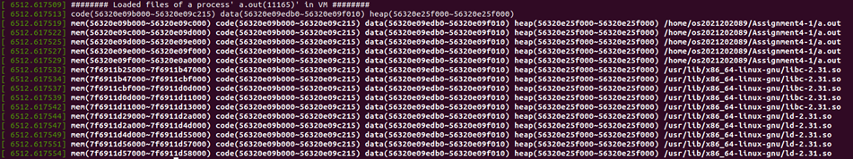

## Introduction

### Assignment 3-1 
-  프로세스의 PID 를 입력값으로 받아 해당 프로세스의 메모리 영역 정보를 출력하는 Kernel Module 을 구현한다.
- 이를 위해 Assignment1 과제에서 구현하였던 ftrace 시스템 콜(번호 336)을 기반으로 새로운 시스템콜을 wrapping 하며, hooking 함수의 이름은 file_varea 로 정의한다. 출력해야 하는 정보는 다음과 같다.
    - 프로세스 이름과 PID
    - 해당 프로세스의 메모리 정보가 위치하는 가상 메모리 주소
    - 데이터 영역 주소, 코드 영역 주소, 힙(Heap) 영역 주소
    - 해당 메모리 정보의 원본이 되는 파일의 전체 경로

<br>

### Assignment 4-2 
- Page Replacement 알고리즘 시뮬레이터를 User-level program 으로 구현한다.
- 프로그램은 입력 파일로부터 사용 가능한 Page Frame 수와 Page reference string 을 읽어온 뒤, 다음의 네 가지 page replacement 알고리즘을 수행한다.
    - Optimal (OPT)
    - FIFO (First In, First Out)
    - LRU (Least Recently Used)
    - Clock (Second-Chance) Algorithm
- 각 알고리즘은 동일한 Page reference string 과 Page Fault 의 발생 횟수에 대해서 Page Fault Rate 를 계산하여 비교한다.


## Result

### Assignment 4-1

#### 1) 디렉토리 생성 및 이동 && file_varea.c 작성
```
mkdir Assignment 3-1
cd Assignment 3-1
vi file_varea.c
```

#### 2) Makefile 작성 && make
```
vi Makefile
make clean && make
```

#### 3) make를 통해 생성된 file_varea.ko 모듈을 커널에 로드한다.
```
sudo insmod file_varea.ko
```

#### 4) test.c 작성
```
#include <unistd.h>
#include <sys/types.h>
#include <linux/unistd.h>

#define __NR_ftrace 336
int main(void){
        syscall(__NR_ftrace,getpid());
        return 0;
}
```

#### 5) test.c 컴파일 및 실행 && 커널 버퍼 출력 및 확인
```
gcc test.c
./a.out
dmesg
```


### Assignment 4-2

#### 1) 디렉토리 생성 및 이동 && page_replacement_simulator.c 작성
```
mkdir Assignment 3-1
cd Assignment 3-1
vi page_replacement_simulator.c
```

#### 2) Makefile 작성 && make
```
vi Makefile
make
```

#### 3) Test case 01,02,03 생성 (입력파일)

```
vi input.1

3
7 0 1 2 0 3 0 4 2 3 0 3 2

vi input.2

3
1 2 3 4 2 1 2 1 3 1

vi input.3

4
1 3 0 3 5 6 3 2 5 2 4 1 0 5

```

#### 4) Test case 수행 && 각 알고리즘 성능 분석

📌 Test case 01


- OPT 가 가장 낮은 Page Faults (7 회)를 기록하였다.
	이는 미래 참조 정보를 통해, 정확히 가장 손해가 적은 페이지를 교체하기 때문이다.
- FIFO 의 성능이 가장 낮음
	해당 테스트 케이스는 초기 페이지들이 자주 재사용되지 않아서, Page Faluts 가 10 회로 가장 높게 나옴.
- LRU 와 Clock 은 동일한 성능
	Reference bit 기반 Clock 이 LRU 와 같은 결과가 나왔다, 이는 LRU 가 오래된 페이지를 선택하는 알고리즘에서 차이를 만들지 못함을 의미한다.
    정리하면, Input.1 에서는 OPT< LRU = CLOCK <FIFO 순으로 우수한 성능을 보였다.
    이는, STRIDE 가 넓고 다양한 페이지가 등장하는 케이스라, FIFO 가 가장 취약함을 의미한다.


📌 Test case 02


-	OPT 는 Page Fault 가 5 번만 발생하고 가장 효율적이다.
	초기 구간 1,2,3,4 를 제외하고, 이후 패턴은 반복성이 높아서 OPT 가 성능이 다른 모델에 비해 좋게 나옴을 알 수 있다.
-	FIFO 는 7 회로 성능이 가장 떨어진다.
	초반 1,2,3, 상태에서 4 가 들어오며 교체가 되고, 이후 반복 패턴과도 잘 맞지 않음을 알 수 있다.
-	LRU 와 Clock 는 동일한 성능(6 회)
	해당 입력은 반복되는 부분이 많아서, 최근에 자주 쓰인 페이지가 명확히 구분되어서, LRU 모델이 효과적이다.
-. Clcok 도 참조 비트덕분에 LRU 와 같은 성능을 보인다.

- 반복되는 참조 패턴이 나타나면서 OPT 가 유리하고, LRU/Clock 성능이 잘 나옴을 알 수 있다. 하지만  FIFO 는 패턴을 고려하지 못해서, 가장 높은 Page Fault 가 발생한다.


📌 Test case 03


-	OPT 가 가장 적은 Page Fault(8 회)
	참조열이 길고 다양하지만, 미래 참조 기반 선택을 하는	OPT 가 가장 효울적으로 결과가 나옴을 알 수 있다.
-	FIFO / LRU / Clock 모두 동일한 Page Fault 수 (10 회)
    - 이는 참조 패턴이 랜덤에 가까워서 Recency(최근성) 기반 전략이 크게 이득을 보지 못함을 알 수 있다.
    - LRU 조차 오랫동안 활용된 페이지가 일정하지 않아서, victim 선택이 FIFO 와 비슷해짐을 알 수 있다.
    - Clock 도 Reference bit 만으로는 OPT 만큼의 성능이 나오지 않음을 알 수있다.
 페이지 사용 패턴이 불규칙적일 때는 FIFO, LRU, Clock 모두 비슷한 성능을 보인다. 이때 OPT 는 미래 정보를 알고 있어서, 가장 성능이 좋게 나옴을 알 수 있다.

#### 5) 각 알고리즘 종합 분석

1.	항상 OPT 가 가장 좋은 성능을 가진다.
-	OPT 는 미래 참조를 완전히 알고 있으므로, 이론적으로 항상 최소의 Page Fault 값을 가진다.
-	SSI(Page replacement theory)의 기준선(baseline) 역할을 함.
2.	FIFO 는 대부분의 입력에서 최악의 성능을 가진다.
-	페이지의 실제 활용도를 고려하지 않는다.
-	오래 들어온 페이지부터 제거하는 방식은 비효율적임을 알 수 있다.
-	Belady anomaly 가 나타날 수 있는 대표 알고리즘
-	세가지 테스트 케이스 모두 FIFO 가 가장 높은 Page Falut 를 기록하였다.
3.	LRU 는 현실적인 대안으로 일정하게 좋은 성능을 가진다.
-	최근 사용된 페이지는 곧 다시 사용될 가능성이 높다는 localiy 에 근거한다.
-	대부분의 경우 FIFO 보다 좋고, OPT 에 근접한 결과를 보인다.
4.	Clock 은 LRU 보다 단순하지만 성능은 거의 동일하다.
-	실제 OS 는 LRU 를 직접 구현하기 어렵기 때문에 Clock 을 사용한다.
-	해당 과제의 테스트 케이스에서도 LRU 와 동일한 결과를 유지한다.
-	성능 대비 구현 복잡도가 LRU 보다는 낮다.

5. 테스트 케이스별 성능 패턴

| 입력 | 패턴특징 | Page Faults |
| :--- | :--- | :--- |
| input.1 | 다양한 페이지 분포 | OPT < LRU = Clock < FIFO |
| Input.2 | 반복되는 참조 패턴 | OPT < LRU = Clock < FIFO |
| Input.3 | 불규칙/랜덤 패턴 | OPT < FIFO = LRU = Clock |

-> Locality 가 강한 입력에서는 LRU/Clock 가 성능이 좋게 나옴을 알 수 있고, Locality 가 약한 랜덤형 입력에서는 FIFO/LRU/Clock 모두 유사한 결과가 나오는 것을 알 수 있다.

#### 정리

- OPT 는 비교 기준이 되는 이상적 알고리즘으로 항상 최고의 성능을 보인다.
- FIFO 는 Locality 를 고려하지 않으므로, 모든 케이스에서 가장 낮은 성능을 기록하였다.
- LRU 는 현실적인 알고리즘으로 안정적으로 높은 성능을 보여주었다.
- Clock 도 LRU 가 유사한 알고리즘으로 LRU 와 동일한 성능을 기록하였다.

## 고찰 

이번 과제를 하면서 운영체제에서 메모리가 어떻게 관리되는지, 그리고 프로세스가 어떤 구조로 돌아가는지를 훨씬 더 이해할 수 있었다.
- Assignment 3-1 에서는 커널 내부 주소들을 직접 출력해보면서, 이론시간에 개념으로만 배워서 실제로 수치를 확인 해보지 못했던 영역들(코드, 데이터, 힙)이 실제로 어디에 존재하는지 확인할 수 있었다.
- Assignment 3-2 에서는 시뮬레이터를 만들면서 각 페이지 교체 알고리즘이 얼마나 다르게 동작하는지 실험적으로 확인할 수 있었다. 같은 입력인데도 알고리즘마다 page fault 가 크게 달라지는 걸 보면서, 운영체제가 왜 locality 를 중요하게 여기는지 이해할 수 있었던 것 같다.
특히 Clock 알고리즘에서는 이동 규칙 하나 때문에 결과가 달라져서, 구현할 때 정확한 이해가 더 중요하다는 걸 알게된 것 같다.
중간중간 헷갈리는 부분도 많았지만, 직접 알고리즘을 시각화해보니 훨씬 쉽게 이해할 수 있었다.
이번 과제를 통해 단순히 이론을 외우는 것보다, 직접 구현하고 테스트해보는 경험이 훨씬 큰 도움이 된다는 걸 느꼈다.
무엇보다도, 운영체제의 내부 동작을 직접 코드를 통해 재현해봤다는 점이 가장 의미 있었다. 앞으로 다른 시스템 코드나 커널 관련 작업을 하게 되어도 이번 경험이 큰 밑바탕이 될 것 같다.

