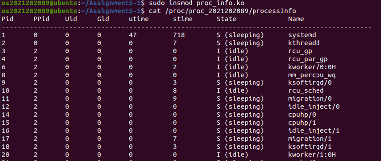
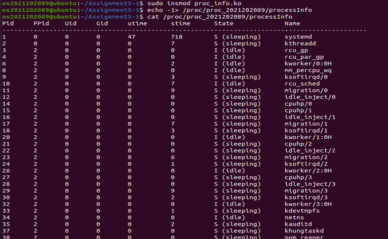
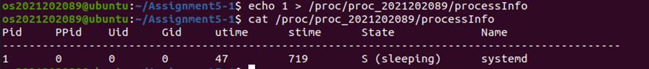
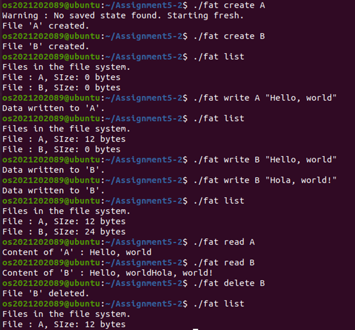

## Introduction

### Assignment 4-1 
Linux 커널의 proc 파일 시스템을 활용하여 프로세스의 정보를 user  공간에서  확인할  수  있도록  하는  것을  목표로  한다.  이를  위해 /proc/proc_학번/processInfo 형태의 가상 파일을 생성하고, 파일을 읽는 시점에 커널 내부의 task_struct 정보를 탐색하여 프로세스의 PID, PPID, UID, GID, utime, stime, state 및 프로세스 이름을 출력하도록 해야한다.

### Assignment 4-2  
FAT(File Allocation Table) 구조를 기반으로 하는 user 수준 파일 시스템을 설계하고 구현하는 것을 목표로 한다. FAT 테이블, 파일 Entry 영역, 그리고 데이터 영역으로 구성된 파일 시스템을 메모리 상에서 관리하며, 파일 생성, 데이터 쓰기, 데이터 읽기, 파일 삭제, 저장된 파일 목록 출력 기능을 제공하도록 구현 해야한다. 파일이 저장될 때 고정된 크기의 데이터 블록을 사용하며, 블록 크기를 초과하는 경우 FAT 테이블을 통해 추가 블록을 연결하는 방식으로 파일 데이터를 저장한다. 또한 프로그램 종료 시 파일 시스템 상태(FAT 테이블, 파일 엔트리 정보, 데이터 영역)를 디스크에 저장하고, 실행 시 해당 상태를 복원하여 지속성을 유지하도록 구현해야 한다.

---

## Result

### Assignment 4-1 

#### 1) 디렉토리 생성 및 이동 && proc_info.c 작성
```
mkdir Assignment5-1
cd Assignment5-1
vi proc_info.c
```

#### 2) Makefile 작성 및 make
```
vi Makefile
make clean && make
```

#### 3) 커널에 모듈 로드(삽입)
```
sudo insmod proc_info.ko
lsmod | grep proc_info   # 모듈이 삽입됐는지 확인
```

#### 4) 테스트 (Proc 파일 작성)

 a) Proc 파일에 write 요청이 없었거나, -1 값을 쓴 경우

```
cat /proc/proc_2021202089/processInfo
```


<br>

```
echo -1> /proc/proc_2021202089/processInfo
cat /proc/proc_2021202089/processInfo
```



-> 	Proc 파일에 write 요청이 없었거나, -1 값을 쓴 경우에는 pid 가 1 인 프로세스부터 순차적으로 출력됨을 알 수 있습니다

<br>

b)	Proc 파일에 특정 프로세스의 PID 값을 입력한 경우

```
echo 1> /proc/proc_2021202089/processInfo
cat /proc/proc_2021202089/processInfo
```


-> 해당 프로세스의 정보만 출력됨을 알 수 있습니다.

### Assignment 4-2

#### 1) 디렉토리 생성 및 이동 && fat.c 작성
```
mkdir Assignment5-2
cd Assignment5-2
vi fat.c
```

#### 2) Makefile 작성 및 make
```
vi Makefile
make clean && make
```

#### 3) 각 명령어 실행


- 처음에 파일이 생성됐을 때, Size = 0 Bytes 로 설정됨.
- 여러 번 write 명령을 실행했을 때 블록 체인을 따라 기존 데이터 뒤에 새 데이터가 정상적으로 append 되는 것을 확인할 수 있음.
- 또한 delete 수행 시 FAT 테이블의 블록이 모두 해제됨을 알 수 있음.

## 고찰
이번 과제를 통해 리눅스의 /proc 파일 시스템이 실제 파일이 아니라 커널 내부 정보를 사용자에게 전달하기 위한 가상 파일 시스템이라는 점을 직접 구현하며 이해할 수 있었다.

Assignment 5-1 에서는 task_struct 를 순회하고 utime, stime, state 등 프로세스 정보를 정리된 형태로 출력하면서, 커널 레벨 자료구조를 안전하게 접근하기 위한 시스템 콜, 커널 메모리등의 사용법을 알게 된 것 같다.

Assignment5-2 에서는 FAT 파일 시스템을 단순화해 직접 구성하면서, 파일이 블록 단위로 저장되고 FAT 테이블이 이를 연결하는 방식이 어떻게 작동하는지를 알 수 있었다.
파일 생성, 삭제, 읽기/쓰기 같은 기본 기능을 모두 구현해 보며, 블록 관리와 디렉토리 관리가 실제 파일 시스템에서 얼마나 중요한 역할을 하는지 알게 되었다
또한 프로그램 종료 후 상태를 파일로 저장하고 재시작 시 파일이 복원됨을 통해 메모리–디스크 간의 데이터 일관성 유지 개념도 알 수 있었다.
전체적으로 이번 과제는 운영체제의 프로세스 관리와 파일 시스템 구조를 코드 레벨에서 직접 다뤄볼 수 있는 좋은 경험이었으며, 단순히 이론으로만 배웠던 개념들이 실제 동작 과정과 연결되면서 이해가 훨씬 깊어진 것 같다.
